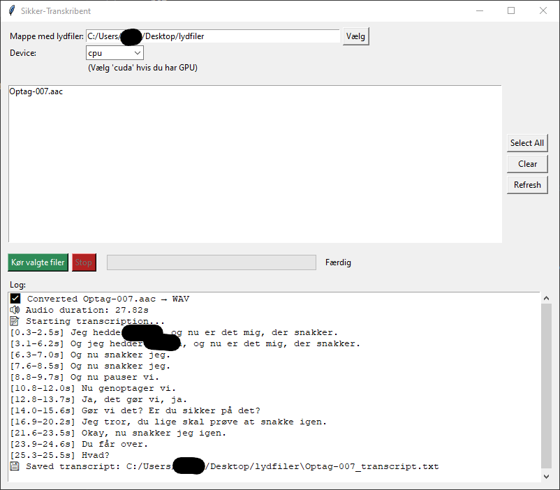

# Sikker-Transkribent

Sikker-Transkribent er et brugervenligt GUI-program, der transskriberer lydfiler til tekst ved hjælp af **Whisper**-modeller. Programmet understøtter batch-transskription, viser fremdrift og giver mulighed for at stoppe processen undervejs.




---

## Funktioner

* Transskriber flere lydfiler i en mappe.
* Vælg CPU eller GPU (`cuda`) til transskription.
* Fremdriftsindikator per fil og realtids-log.
* Automatisk konvertering af ikke-WAV filer til WAV ved hjælp af `ffmpeg`.
* Gemmer tidsstemplede transskriptioner.

---

## Krav

* [**Python 3.10+**](https://www.python.org/downloads/)
* Pakker i `requirements.txt` (installeres automatisk via setup)
* **ffmpeg** er inkluderet i `ffmpeg`-mappen
* GPU er valgfrit (kan gøre transskription hurtigere med CUDA)
* Kan også være påkrævet at installere [Build Tools for Visual Studio](https://visualstudio.microsoft.com/visual-cpp-build-tools/)
* Sørg for at vælge **C++ build tools** under installationen

---

## Installation (Windows)

1. **Download programmet fra GitHub**
   Klik på “Code” → “Download ZIP” og pak filerne ud til en mappe på din computer.

2. **Kør setup**

   Dobbeltklik på `setup.bat` i projektets rodmappe, eller kør den i Kommandoprompt:

```bat
setup.bat
```

Dette vil:

* Oprette et virtuelt miljø i `.venv`
* Aktivere det
* Opgradere pip
* Installere de nødvendige Python-pakker

3. **Start programmet**

* Dobbeltklik på `run_app.bat` for at åbne GUI’en i en separat proces, eller
* Åbn Kommandoprompt i mappen og kør:

```bat
.venv\Scripts\activate.bat
python app.py
```

---

## Brug

1. Klik på **Vælg** for at vælge mappen med lydfiler.
2. Vælg evt. **Device** (`cpu` eller `cuda`) hvis du har en GPU.
3. Marker en eller flere filer i listen (eller klik **Select All**).
4. Klik på **Kør valgte filer** for at starte transskriptionen.
5. Du kan stoppe processen når som helst med **Stop**-knappen.
6. Transskriptionerne gemmes ved siden af de originale filer med `_transcript.txt` som suffix.

---

## Bemærkninger

* Programmet konverterer automatisk alle lydfiler til WAV ved hjælp af den medfølgende `ffmpeg` for at fikse eventuelle fejl med optagelser såsom pausede/genoptagede optagelser.
* Understøtter formater som mp3, m4a, wav m.fl.
* GPU-brugere skal have **CUDA installeret**, hvis `cuda` vælges som device.

---

